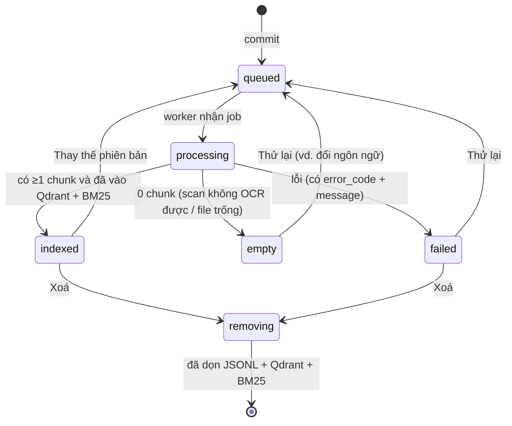

# Detail Design — Tính năng "Upload Documents" (v2)

| Mục | Nội dung |
|---|---|
| Trạng thái | **Bản nháp — chờ duyệt**. Chưa có dòng code nào bị thay đổi. |
| Ngày | 2026-09-25 |
| Phạm vi code | `api/main.py`, `ui/index.html`, `src/pipeline/01..03`, `src/chat/rag_chain.py`, `src/retrieval/hybrid_retriever.py`; mới: `src/ingest/`, `tests/` |
| Không đụng tới | model embedding/reranker, RRF, logic chọn tier, `clause_assembler.py`, `eval/`, `Report/`, endpoint `/config` |

---

## 0. Tóm tắt

Hiện tại, upload chỉ lưu file vào `data/<group>/` rồi đề nghị chạy lại toàn bộ chỉ mục (reindex). Khảo sát cho thấy luồng này hỏng ở nhiều chỗ:

- **Reindex gọi từ giao diện chưa bao giờ chạy được trên máy này.** Tiến trình parse bị crash ngay ở lệnh `print` đầu tiên vì bảng mã cp1252 (D1, đã tái hiện).
- **File DOCX được nhận nhưng không bao giờ được index** (D2).
- **Reindex toàn bộ xoá collection Qdrant**, nên trong 5–15 phút Chat trả kết quả thiếu (D4).
- **Xoá tài liệu không xoá khỏi chỉ mục** (D3).
- **Tài liệu tiếng Anh bị OCR thừa ở từng trang** (D7).

Thiết kế v2 gồm 5 thay đổi chính:

1. **Upload hai bước.** File được tải lên vùng tạm và kiểm tra trước (loại file thật, dung lượng, mật khẩu, trùng tên hoặc trùng nội dung, gợi ý ngôn ngữ). Người dùng xác nhận thì file mới được đưa vào kho.
2. **Index tăng dần theo từng tài liệu**, qua một hàng đợi job có một worker chạy trong subprocess UTF-8. Các bước: parse → upsert Qdrant → dọn các point cũ → cập nhật BM25 → nạp lại chỉ mục nóng. Collection không bị xoá nên Chat chạy liên tục.
3. **Bộ trích xuất DOCX riêng.** Nó tái tạo số thứ tự tự động, đọc bảng và số trang Word, rồi dùng chung phần chunk với PDF. **Đường xử lý PDF giữ nguyên.**
4. **Ngôn ngữ theo từng tài liệu** (`vi` hoặc `en`). Với `vi`, hệ thống dùng nguyên cấu hình hiện tại.
5. **Metadata riêng cho từng tài liệu**, lưu trong file sidecar. Màn hình Documents hiển thị trạng thái từng file. Chat hiển thị nhãn theo đúng cấu trúc của tài liệu (Chapter/Section/…), còn văn bản pháp quy hiện có giữ nguyên cách hiển thị.

**Cam kết không hồi quy.** Với 34 PDF hiện có, JSONL sinh ra phải **giống hệt từng byte** (cùng `chunk_id`). Nhờ vậy GT v2 và số liệu paper không bị ảnh hưởng, và câu trả lời Chat cho các tài liệu này không đổi. Mỗi giai đoạn triển khai có cổng kiểm thử hồi quy riêng (mục 14).

---

## 1. Mục tiêu, phạm vi, quyết định

### 1.1 Mục tiêu

| ID | Mục tiêu |
|---|---|
| MT-1 | Upload được PDF/DOCX thuộc mọi lĩnh vực (quy chế, hợp đồng, chính sách, báo cáo, tài liệu kỹ thuật…), bằng tiếng Việt hoặc tiếng Anh. Tài liệu tìm được trong Chat khi job xong. Mục tiêu: ≤ 60 giây cho tài liệu 20 trang có lớp chữ, chạy trên CPU. |
| MT-2 | Không mất nội dung một cách âm thầm: file nào cũng có trạng thái cuối cùng kèm lý do. |
| MT-3 | Chat không bị gián đoạn khi thêm, xoá hoặc thay thế tài liệu. |
| MT-4 | Xoá tài liệu/nhóm nghĩa là xoá khỏi mọi chỉ mục (JSONL, Qdrant, BM25). |
| MT-5 | Không hồi quy các chức năng khác (mục 1.4). |

### 1.2 Quyết định đã chốt (2026-09-25)

| # | Chủ đề | Quyết định | Hệ quả trong design |
|---|---|---|---|
| Q1 | Định dạng | Chỉ PDF + DOCX | Định dạng khác bị từ chối kèm hướng dẫn. Kiến trúc extractor cho phép thêm định dạng sau (mục 7.1). |
| Q2 | Ngôn ngữ | Việt + Anh, giữ model hiện tại | Hồ sơ ngôn ngữ theo tài liệu. Không đổi embedding/reranker. |
| Q3 | Được phép sửa ngoài upload | (a) Index tăng dần + Chat liên tục; (b) màn hình Documents; (c) hiển thị trích dẫn trong Chat; (d) xoá tài liệu/nhóm | Mọi thay đổi ngoài upload chỉ nằm trong 4 vùng này (ma trận mục 13). |
| Q4 | Bảo mật | Không xác thực (dùng nội bộ) | Chỉ giới hạn dung lượng/số file/loại file, làm sạch tên file và phục vụ file an toàn (mục 12). |

### 1.3 Ngoài phạm vi

- Các định dạng TXT/MD/HTML/ảnh/XLSX/CSV/PPTX và file `.doc` cũ.
- Đổi model, hoặc hỗ trợ ngôn ngữ khác ngoài Việt/Anh.
- Đăng nhập và phân quyền.
- Sửa chunker cho các PDF hiện có, vì việc này sẽ đổi `chunk_id` (xem Phụ lục C).
- Endpoint `/config`. Endpoint này có lỗi nghiêm trọng (Phụ lục C, O1) nhưng không thuộc phạm vi được phép sửa.

### 1.4 Bất biến không hồi quy (hợp đồng)

| ID | Bất biến | Cách kiểm |
|---|---|---|
| INV-1 | Với 34 PDF hiện có (không có sidecar), JSONL do parser mới sinh ra **giống hệt từng byte** JSONL do parser hiện tại sinh ra. | Cổng G1 |
| INV-2 | `chunk_id`, point id Qdrant và bản ghi BM25 của các tài liệu hiện có không đổi, nên GT v2 và số liệu paper giữ nguyên. | Suy ra từ INV-1; kiểm thêm bằng G2 |
| INV-3 | Câu trả lời Chat (văn bản) cho các câu hỏi chỉ chạm tới tài liệu hiện có không đổi. | G3 |
| INV-4 | Endpoint cũ giữ nguyên đường dẫn và các field cũ trong response; chỉ được **thêm** field. | G5 |
| INV-5 | CLI `python -m src.pipeline.0x` giữ hành vi mặc định; tính năng mới chỉ bật qua cờ mới. | G4 |
| INV-6 | Không đổi model, tham số retrieval/rerank, logic tier, `clause_assembler.py`, `eval/`, `Report/`. | Review diff |

---

## 2. Hiện trạng

### 2.1 Luồng hiện tại

1. UI (`ui/index.html:1296-1415`): người dùng kéo thả file, chọn nhóm, rồi gọi `POST /upload-docs`.
2. API (`api/main.py:631-688`): kiểm tra đuôi file, đọc toàn bộ file vào RAM, ghi đè vào `data/<slug>/<tên>`.
3. UI hiện `confirm()` hỏi có reindex không. Nếu có, gọi `POST /reindex`, API chạy 3 subprocess `01 → 02 → 03` (`api/main.py:443-475`), còn UI poll `GET /reindex/status`.

### 2.2 Lỗi và hạn chế

| ID | Mức | Vấn đề | Bằng chứng | Hệ quả |
|---|---|---|---|---|
| D1 | **Nghiêm trọng** | Reindex gọi từ API crash ngay khi bắt đầu | `api/main.py:456` chạy subprocess với stdout là pipe, nên Python con dùng bảng mã cp1252. `01_parse_chunk.py:1413` in ký tự `→` và gây `UnicodeEncodeError`. **Đã tái hiện đúng lệnh này** (ghi ra thư mục tạm): returncode 1, 0 file JSONL. | Luồng upload → "Reindex now" chưa bao giờ hoàn tất. Chạy tay trong terminal thì không lỗi (console dùng Unicode), nên lỗi này dễ bị bỏ sót. |
| D2 | **Nghiêm trọng** | DOCX được nhận nhưng không bao giờ được index | `api/main.py:508` cho phép `.docx`, nhưng parser chỉ quét `rglob("*.pdf")` (`01_parse_chunk.py:1400`). | UI báo "tải lên thành công", nhưng Chat không bao giờ tìm thấy nội dung. |
| D3 | Cao | Xoá tài liệu/nhóm không xoá khỏi chỉ mục | `delete_document` chỉ xoá file và sidecar (`api/main.py:615-628`). `run()` không bao giờ xoá `data/processed/<stem>.jsonl`, trong khi bước 02/03 đọc mọi `*.jsonl`. | Sau khi xoá rồi reindex, tài liệu vẫn nằm trong Qdrant, BM25, `/sources` và bảng Documents. |
| D4 | Cao | Reindex toàn bộ xoá collection rồi nạp lại dần | `02_embed_index.py:110-115` (`fresh=True`). Embed toàn bộ mất khoảng 815 s trên CPU (đo 2026-07-28). | Trong 5–15 phút Chat trả kết quả thiếu, dù UI báo "You can keep using the chat" (`ui/index.html:1408`). |
| D5 | Cao | Ghi đè không cảnh báo; file trùng tên ở hai nhóm đè JSONL của nhau | `write_bytes` (`api/main.py:676`) không kiểm tra trước khi ghi. JSONL được đặt tên theo stem (`01_parse_chunk.py:1318`). Windows không phân biệt hoa thường. | Mất phiên bản cũ. Hai file `abc.pdf` ở hai nhóm thì chỉ còn một trong chỉ mục. |
| D6 | Trung bình | Không giới hạn dung lượng và không kiểm tra nội dung | `await f.read()` đọc cả file vào RAM (`api/main.py:675`). Không kiểm tra magic bytes, mật khẩu PDF hay số trang. | File sai đuôi hoặc bị hỏng chỉ lộ ra khi reindex; file lớn chiếm RAM. |
| D7 | Trung bình | Tài liệu tiếng Anh bị OCR thừa ở từng trang | Bộ kiểm tra dấu tiếng Việt áp dụng toàn cục (`01_parse_chunk.py:192-198`). Trang tiếng Anh có tỉ lệ dấu 0.000 nên bị coi là "hỏng" → OCR 300 DPI → kết quả OCR cũng "hỏng" → quay về text gốc (`:225-232`). **Đo được:** thừa 0,8 s/trang với trang đơn giản, 1,2–1,3 s/trang với trang đầy chữ. | 100 trang tiếng Anh tốn thêm khoảng 2 phút. Nếu OCR sinh ra vài ký tự có dấu, text OCR (kém hơn) có thể thay thế text gốc. |
| D8 | Thấp | Nhóm tạo qua upload thiếu loại và đơn vị; dropdown lẫn thư mục backup; số file chỉ đếm PDF | `api/main.py:656`. `_processed_dir_names()` không loại `processed_backup_20260728` (`:515-517`). Đếm bằng `glob("*.pdf")` (`:563`, `:606`). | Dropdown hiện `processed_backup_20260728` như một nhóm. |
| D9 | Trung bình | Màn hình Documents không hiện file chưa index hoặc bị lỗi; "Indexed 100%" được gán cứng | Bảng dựng từ `/sources` (tức là từ JSONL); `ui/index.html:1030`. | Người dùng không biết file nào chưa tìm được. |
| D10 | Trung bình | Chat ghi "Điều/Khoản/Chương" cho mọi tài liệu | `_legal_locator` (`rag_chain.py:128-150`); tier2/tier3 (`:285`, `:312`, `:392`, `:403`); các tag ở `ui/index.html:952-953`. | Tài liệu dùng Chapter/Section/1.2 bị gắn nhãn sai. |
| D11 | Trung bình | Link trích dẫn chỉ nhận `*.pdf` không có dấu cách; `/pdf` chỉ phục vụ PDF | Regex `(\S+\.pdf)` (`ui/index.html:849`); `serve_pdf` (`api/main.py:372-388`). | DOCX không mở được. Tên file có dấu cách tạo link sai. |
| D12 | Thấp | BM25 incremental giả định mọi nguồn là `.pdf`; ghi file không atomic | `_jsonl_to_source_name` (`03_bm25_index.py:57-59`). `pickle.dump` ghi thẳng vào file đích (`:134-136`). JSONL cũng ghi thẳng (`01_parse_chunk.py:1319`). | Crash giữa chừng để lại file hỏng. |
| D13 | Thấp | Trạng thái reindex chỉ nằm trong RAM; `rglob` quét cả thư mục nội bộ | `_reindex_state` (`api/main.py:433`). `serve_pdf` và `delete_document` không bỏ qua `processed*` (`:377`, `:621`). | Restart server là mất trạng thái. Khi có vùng tạm (v2), có thể phục vụ hoặc xoá nhầm bản sao. |

---

## 3. Kiến trúc đề xuất

### 3.1 Tổng quan

```
 UI (Upload modal v2, Documents v2)
   │ ① POST /uploads (multipart)                 ③ GET /documents, GET /jobs/{id} (poll)
   ▼                                             ▲
 API ── UploadService ──► data/processed/_ingest/staging/<upload_id>/   (kiểm tra, băm, gợi ý ngôn ngữ)
   │ ② POST /uploads/{id}/commit
   │    └─► chuyển file → data/<group>/<file> + sidecar <file>.meta.json
   │    └─► JobQueue (lưu ra đĩa) ──► 1 worker thread
   │                                     │ subprocess (PYTHONUTF8=1):  python -m src.ingest.worker --job <file>
   │                                     │   1. parse   (PDF: đường cũ | DOCX: extractor mới) → <stem>.jsonl (atomic)
   │                                     │   2. embed + upsert Qdrant  (point id = chunk_id, như hiện tại)
   │                                     │   3. xoá point cũ của tài liệu (source = X, id ∉ tập mới)
   │                                     │   4. BM25 incremental → bm25.pkl (atomic)
   │                                     ▼
   └──────────── hot reload trong RAM: BM25Retriever + ClauseIndex (≈0,15 s, không tải lại model)
```

### 3.2 Thành phần

| Thành phần | File | Mới/Sửa | Vai trò |
|---|---|---|---|
| Validator & sniffer | `src/ingest/validate.py` | Mới | Magic bytes, kiểm tra zip, mật khẩu, số trang, gợi ý ngôn ngữ |
| Chuẩn hoá tên file | `src/ingest/naming.py` | Mới | Tên an toàn cho Windows và cho regex liên kết trích dẫn |
| Kho sidecar + registry | `src/ingest/registry.py` | Mới | Đọc/ghi `<file>.meta.json` (atomic); hợp nhất FS + sidecar + JSONL + job |
| Hàng đợi job | `src/ingest/jobs.py` | Mới | Lưu job ra đĩa, 1 worker, phục hồi sau restart, timeout |
| Worker | `src/ingest/worker.py` | Mới | Chạy parse/embed/BM25 cho một job trong subprocess |
| Trích xuất DOCX | `src/ingest/docx_extract.py` | Mới | Trả về `pages` + `table_chunks` + `linear_text` + `headings` |
| Parser | `src/pipeline/01_parse_chunk.py` | Sửa (additive) | Tách `process_pdf` thành extract + `chunk_and_write`; thêm `process_docx`, dispatcher, hồ sơ ngôn ngữ |
| Qdrant incremental | `src/pipeline/02_embed_index.py` | Sửa (additive) | Thêm hàm `upsert_sources` / `remove_sources`; CLI giữ nguyên |
| BM25 incremental | `src/pipeline/03_bm25_index.py` | Sửa | Lấy tên nguồn từ nội dung JSONL; hỗ trợ xoá nguồn; ghi atomic; giữ thứ tự như full rebuild |
| Hot reload | `src/retrieval/hybrid_retriever.py`, `src/chat/rag_chain.py` | Sửa (additive) | `reload_sparse()`, `reload_indexes()`; nhãn trích dẫn theo cấu trúc |
| API | `api/main.py` | Sửa | Endpoint mới (mục 6); sửa `/groups`, xoá tài liệu/nhóm, `/reindex`, `/pdf` |
| UI | `ui/index.html` | Sửa | Upload modal v2, Documents v2, luồng xoá, link trích dẫn DOCX |

### 3.3 Quyết định kiến trúc

| ID | Quyết định | Lý do | Phương án bị loại |
|---|---|---|---|
| AD-1 | Đường xử lý PDF giữ nguyên. DOCX có extractor riêng và dùng chung phần chunk + ghi JSONL. | INV-1. Đã thử chuyển DOCX sang PDF bằng PyMuPDF 1.27 trong venv: **mất số thứ tự tự động** ("1.", "2." của style List Number) và **mất bảng** (không `find_tables` được, ô bị dàn phẳng thành từng dòng). Chunker cần các dấu số này. | Chuyển DOCX→PDF bằng PyMuPDF (mất cấu trúc); LibreOffice (chưa cài); Word COM (không phù hợp chạy phía server). |
| AD-2 | Index tăng dần theo tài liệu, dựa trên `chunk_id` ổn định (băm nội dung, `01_parse_chunk.py:971-987`). **Không xoá collection.** | Chat liên tục (MT-3); chỉ tốn thời gian embed của tài liệu mới. | Blue-green bằng alias Qdrant: phải đổi hành vi CLI `02` (vi phạm INV-5). Để dành làm giai đoạn tuỳ chọn P5. |
| AD-3 | Hàng đợi một worker; pipeline chạy trong subprocess với `PYTHONUTF8=1`; job được lưu ra đĩa. | Cô lập crash native (PyMuPDF/OCR), tránh tranh GIL với Chat, sửa D1, sống qua restart. | Chạy trong tiến trình API: rẻ hơn khoảng 15 s tải model nhưng rủi ro crash và giật Chat. |
| AD-4 | Metadata theo tài liệu lưu ở sidecar `<file>.<ext>.meta.json` cạnh file gốc. | Quy ước này đã được dự trù sẵn (`delete_document` xoá `<name>.meta.json`, `api/main.py:625-627`). Sidecar di chuyển và xoá cùng file. | File manifest trung tâm: dễ tranh ghi và dễ lệch với file thật. |
| AD-5 | Upload hai bước: stage → commit. | Người dùng thấy lỗi, trùng lặp và gợi ý ngôn ngữ **trước khi** file vào kho. | Upload một phát (như hiện tại): lỗi chỉ lộ ra sau khi đã ghi đè. |
| AD-6 | Khoá tài liệu vẫn là `source` (tên file an toàn). Tên phải **duy nhất trong toàn kho theo stem, không phân biệt hoa thường**. | JSONL, payload Qdrant, BM25, ClauseIndex và GT eval đều dùng `source`. Stem duy nhất giữ `<stem>.jsonl` không đụng nhau (D5). | Thêm nhóm vào `source`: đổi `chunk_id` của toàn bộ corpus (vi phạm INV-2). |
| AD-7 | Ngôn ngữ theo tài liệu. `vi` = **không ghi đè gì**; `en` = tắt kiểm tra dấu, OCR bằng `eng`. | INV-1 (tài liệu cũ mặc định là `vi`); sửa D7. | Tắt `script_check` toàn cục: làm hỏng lại 3 tài liệu scan tiếng Việt có lớp chữ mất dấu. |
| AD-8 | Trạng thái nội bộ đặt dưới `data/processed/_ingest/`. | Mọi chỗ đọc JSONL đều dùng `glob("*.jsonl")` không đệ quy (`api/main.py:186`, `clause_assembler.py:36`, `02:61`, `03:46`, `eval/*`). Parser và `/groups` đã bỏ qua `processed`. | Thư mục mới ở cấp `data/`: sẽ hiện ra như một "nhóm" và bị parser quét. |

---

## 4. Mô hình dữ liệu

### 4.1 Bố cục thư mục

```
data/
├── groups.json                        # registry nhóm (thêm field tuỳ chọn: language)
├── <group>/
│   ├── <file>.pdf | <file>.docx       # bản gốc, tên đã chuẩn hoá
│   ├── <file>.<ext>.meta.json         # MỚI: sidecar, chỉ có với tài liệu vào qua v2
│   └── <file>.<ext>.prev              # MỚI, tạm thời: bản cũ khi đang thay thế (xoá khi thành công)
└── processed/                         # = config data.processed_dir
    ├── <stem>.jsonl                   # KHÔNG ĐỔI định dạng; ghi atomic (.jsonl.tmp → replace)
    ├── bm25.pkl                       # KHÔNG ĐỔI định dạng; ghi atomic
    └── _ingest/                       # MỚI
        ├── staging/<upload_id>/{manifest.json, <file_key>.<ext>}
        ├── failed/<job_id>/<file>     # bản mới bị lỗi khi thay thế (để xem/thử lại)
        └── jobs/<job_id>.json
```

`*.prev` và `*.meta.json` không khớp `*.pdf` / `*.docx`, nên parser, `/pdf` và bộ đếm file tự động bỏ qua chúng.

### 4.2 Sidecar `<file>.<ext>.meta.json`

```json
{
  "schema": 1,
  "source": "Quy-dinh-cong-tac-phi-2026.docx",
  "original_filename": "Quy định công tác phí 2026.docx",
  "group": "Quy-dinh-noi-bo",
  "file_type": "docx",
  "size_bytes": 184233,
  "sha256": "9f2c…",
  "language": "vi",
  "metadata": { "title": "Quy định công tác phí", "doc_type": "", "doc_number": "", "issuing_body": "" },
  "uploaded_at": "2026-09-25T10:12:03+07:00",
  "status": "indexed",
  "status_detail": { "step": "done", "error_code": null, "message": null },
  "last_job_id": "j20260925-101203-ab12",
  "report": { "pages": 12, "ocr_pages": [], "chunker": "hpad(L2:DIEU_VN+L3:NUM_DOT)",
              "chunks_text": 88, "chunks_table": 14, "warnings": [] },
  "indexed_at": "2026-09-25T10:13:10+07:00"
}
```

- Các field `metadata.*` rỗng nghĩa là **dùng giá trị mặc định của nhóm** (hành vi hiện tại của `group_meta`).
- `status` nhận một trong các giá trị: `queued | processing | indexed | empty | failed | removing`.
- Để tránh tranh ghi: API ghi sidecar lúc commit và khi job kết thúc; worker chỉ ghi `report` và `status` cuối. API và worker không bao giờ ghi cùng lúc. Mọi lần ghi đều là temp + `os.replace`, có thử lại khi gặp `PermissionError` (Windows khoá file đang mở).

### 4.3 `groups.json`

Giữ nguyên. Chỉ thêm field tuỳ chọn `"language": "vi" | "en"` (ngôn ngữ mặc định cho file mới trong nhóm). Nhóm tạo qua upload nhận thêm `doc_type`, `issuing_body`, `language` do người dùng nhập (sửa D8).

### 4.4 JSONL chunk

- **Tài liệu không có sidecar** (34 PDF hiện có, hoặc file chép tay vào `data/`): giữ đúng 16 field hiện tại, đúng thứ tự. Đây là điều kiện của INV-1.
- **Tài liệu vào qua v2** (có sidecar): thêm 4 field **ở cuối** bản ghi:

| Field | Ví dụ | Dùng ở |
|---|---|---|
| `file_type` | `"docx"` | UI (mở/tải file), trích dẫn |
| `language` | `"en"` | UI (nhãn tiếng Anh/Việt) |
| `level_labels` | `{"chapter":"CHAPTER_EN","article":"SECTION_EN","khoan":"NUM_DOT"}` | Nhãn trích dẫn (mục 9) |
| `ingest_version` | `2` | Truy vết |

Các field khác giữ nguyên nghĩa: `source` = tên file an toàn (có đuôi), `chunk_id = make_chunk_id(source, idx, text)` (công thức cũ), `doc_group` = thư mục. `doc_type`, `issuing_body`, `doc_number` lấy từ override trong sidecar nếu khác rỗng; nếu rỗng thì lấy từ registry hoặc `extract_doc_number` như cũ.

### 4.5 Job record `jobs/<job_id>.json`

```json
{
  "id": "j20260925-101203-ab12",
  "type": "ingest",
  "status": "running",
  "created_at": "…", "started_at": "…", "finished_at": null,
  "params": { "items": [ { "source": "abc.docx", "replaces": "abc.pdf" } ] },
  "progress": { "step": "embed", "done": 1, "total": 2, "current": "abc.docx" },
  "results": { "abc.docx": { "status": "indexed", "error_code": null, "message": null, "report": {} } },
  "error": null,
  "log_tail": []
}
```

- `type` là một trong `ingest | remove | reindex`.
- `status` là một trong `queued | running | succeeded | partial | failed | interrupted`.
- Hệ thống giữ lại 200 job gần nhất (cấu hình được).

### 4.6 Trạng thái tài liệu



Tài liệu không có sidecar (34 PDF cũ) được suy ra trạng thái như sau:

- Có JSONL với ít nhất 1 chunk → `indexed`.
- Có file nhưng không có JSONL → `not_indexed`, kèm nút "Index".
- Có JSONL nhưng không có file → `orphan`, kèm nút "Dọn khỏi chỉ mục".

### 4.7 Registry tài liệu (nguồn dữ liệu của `GET /documents`)

Registry là hợp của 4 nguồn:

1. File `*.pdf` / `*.docx` trong `data/` (bỏ qua các thư mục tên bắt đầu bằng `processed`, `.` hoặc `_`).
2. Sidecar.
3. Thống kê JSONL theo `source` (chunk_count, max_page, các metadata như `/sources`).
4. Các job đang `queued` hoặc `running`.

Khi các nguồn lệch nhau, **job đang chạy** thắng, sau đó đến **sidecar**, cuối cùng là **JSONL**. Để nhanh, kết quả đọc JSONL được cache theo `mtime`.

---

## 5. Luồng nghiệp vụ

### 5.1 Upload

```mermaid
sequenceDiagram
    participant U as UI
    participant A as API
    participant S as Staging
    participant Q as JobQueue
    participant W as Worker (subprocess)
    U->>A: POST /uploads (files)
    A->>S: ghi stream từng file (≤ max_file_mb), băm sha256
    A->>A: sniff + validate + gợi ý ngôn ngữ + phát hiện trùng
    A-->>U: 201 {upload_id, báo cáo từng file}
    U->>U: người dùng chọn ngôn ngữ / hành động khi trùng / metadata
    U->>A: POST /uploads/{id}/commit
    A->>A: khoá commit; kiểm tra lại trùng tên; os.replace vào data/<group>/; ghi sidecar(queued)
    A->>Q: enqueue ingest
    A-->>U: 202 {job_id}
    Q->>W: chạy job (PYTHONUTF8=1)
    W->>W: parse → upsert → prune → BM25
    W-->>Q: kết quả từng tài liệu
    Q->>A: hot reload (BM25 + ClauseIndex)
    U->>A: GET /jobs/{id} (poll 2 s) → hiển thị kết quả
```

Các quy tắc chính:

- **Khoá commit.** Một `threading.Lock` bao quanh bước "kiểm tra trùng + chuyển file + ghi sidecar" để hai lần commit song song không đè nhau. Giả định server chạy **một process** (như `start.bat`); điều này phải được ghi rõ trong README.
- **Kiểm tra lại lúc commit.** Kho có thể đã thay đổi kể từ lúc stage. Nếu phát sinh xung đột mới, file đó bị trả về `NAME_CONFLICT` và không được commit.
- **Dọn vùng tạm.** Staging quá 24 giờ bị xoá khi server khởi động và ở mỗi lần gọi `POST /uploads`.

### 5.2 Thay thế phiên bản (trùng tên trong cùng nhóm, người dùng chọn "Thay thế")

1. Lúc commit: đổi tên bản cũ `abc.pdf` → `abc.pdf.prev` (sidecar cũ cũng đổi tên thành `.prev`), chuyển bản mới vào, rồi enqueue job `{source: "abc.docx", replaces: "abc.pdf"}`.
2. Worker parse bản mới ra `abc.jsonl.tmp`, upsert các point mới, xoá point của `replaces` và các point cũ không còn trong tập mới, `os.replace` JSONL, rồi cập nhật BM25 (bỏ nguồn cũ, thêm nguồn mới).
3. **Thành công:** xoá `*.prev`.
4. **Thất bại:** chạy rollback (mục 5.6). Hệ thống khôi phục `*.prev`, chuyển bản mới sang `_ingest/failed/<job_id>/`, và sidecar ghi thông báo "Phiên bản mới lỗi: …; đang dùng lại phiên bản cũ".

### 5.3 Xoá tài liệu / nhóm (sửa D3)

1. `DELETE /documents/{source}` tìm file qua registry (chỉ trong thư mục nhóm, không trong vùng tạm). API xoá file và sidecar **ngay**, rồi enqueue job `remove {sources: [...]}`.
2. Worker xoá `<stem>.jsonl` (chỉ khi các bản ghi trong đó có `source` trùng khớp), xoá point Qdrant theo filter `source == X`, bỏ khỏi BM25, rồi hot reload.
3. `DELETE /groups/{group}` làm tương tự cho mọi tài liệu (mọi loại file hỗ trợ) trong nhóm. `removed_files` giờ đếm đúng.
4. UI **không còn hỏi reindex** sau khi xoá; chỉ hiện trạng thái "Đang xoá" cho tới khi job xong.
5. Nếu tài liệu đang được xử lý bởi một job ingest, job remove sẽ chạy **sau** job đó (FIFO), nên trạng thái cuối luôn nhất quán.

### 5.4 Đồng bộ toàn bộ (`POST /reindex`)

- **Mặc định `mode=sync`, không gián đoạn Chat:**
  1. Parse lại toàn bộ tài liệu. Tài liệu cũ đi đường cũ; tài liệu có sidecar dùng metadata và ngôn ngữ trong sidecar.
  2. **Dọn JSONL mồ côi**: JSONL mà `source` của nó không còn file gốc.
  3. Upsert mọi point, rồi xoá các point có id không nằm trong tập hiện tại.
  4. Dựng lại toàn bộ BM25, rồi hot reload.
- **`mode=rebuild`** là hành vi cũ (xoá và tạo lại collection). Chỉ dùng khi đổi model embedding hoặc tham số vector. UI cảnh báo "Chat sẽ gián đoạn". Worker tự chuyển sang `rebuild` và cảnh báo nếu `vector_size` trong config khác với collection hiện có.
- Mọi lần reindex đều đi qua hàng đợi, nên không bao giờ chạy song song với ingest. `GET /reindex/status` giữ nguyên dạng response (mục 6.2).

### 5.5 Phục hồi sau restart server

Khi server khởi động:

- Job đang `running` được đánh dấu `interrupted` rồi **enqueue lại**. Mọi bước đều idempotent: upsert theo id cố định, xoá theo filter, ghi atomic.
- Sidecar đang `processing` mà không có job hoạt động cũng được enqueue lại.

### 5.6 Bảng lỗi và rollback của job ingest (theo từng tài liệu)

| Hỏng ở bước | Trạng thái để lại | Hành động |
|---|---|---|
| Parse (exception / 0 chunk) | JSONL, Qdrant và BM25 **chưa bị động tới** | Đặt `failed` hoặc `empty`. Nếu đang thay thế: khôi phục `.prev`. |
| Upsert Qdrant (mạng hoặc Qdrant tắt) | Có thể đã có một phần point mới | Xoá point mới (id ∈ tập mới − tập cũ); khôi phục `.prev`; `failed(QDRANT_UNAVAILABLE)`. Retry 3 lần (2/5/10 s) trước khi kết luận. |
| Xoá point cũ | Thừa point cũ, nhưng không thiếu point nào | Retry. Nếu vẫn lỗi thì `partial` (tài liệu tìm được; dọn ở lần sync sau). |
| Ghi JSONL / BM25 | Dữ liệu cũ vẫn nguyên, nhờ ghi atomic | Retry `os.replace` (10 lần × 200 ms), rồi `failed`. |
| Timeout job (mặc định 3600 s) | Tuỳ bước đang chạy | Kill subprocess, rollback như các dòng trên, đặt `failed(TIMEOUT)`. |

Một tài liệu lỗi **không** làm hỏng các tài liệu khác trong cùng job: job khi đó kết thúc ở trạng thái `partial`.

---

## 6. API

### 6.1 Endpoint mới

| Method & path | Mô tả | Response chính |
|---|---|---|
| `POST /uploads` | multipart `files[]`. Ghi stream vào staging và kiểm tra. | `201 {upload_id, expires_at, files:[{file_key, original_name, safe_name, size, sha256, file_type, status:"ok"\|"rejected", reason_code, message, pages, scanned_pages_estimate, ocr_seconds_estimate, language_suggestion, conflict}]}` |
| `POST /uploads/{upload_id}/commit` | JSON `{group:{id} \| {new:{label, doc_type, issuing_body, language}}, files:[{file_key, action:"add"\|"replace"\|"rename"\|"skip", language, metadata:{title, doc_type, doc_number, issuing_body}}]}` | `202 {job_id, documents:[{source, status}]}` |
| `DELETE /uploads/{upload_id}` | Huỷ, xoá vùng tạm | `204` |
| `GET /jobs/{job_id}` | Tiến độ và kết quả từng tài liệu | Job record (mục 4.5) |
| `GET /jobs?active=1` | Các job đang chờ hoặc đang chạy | `{jobs:[…]}` |
| `GET /documents` | Registry (mục 4.7) | `{documents:[{source, group, file_type, size, status, status_detail, language, doc_type, doc_number, issuing_body, title, chunk_count, max_page, uploaded_at, indexed_at, warnings}], summary:{total, indexed, processing, failed}}` |
| `GET /documents/{source}/file` | Phục vụ file gốc | PDF: `inline`. DOCX: `attachment`. Luôn kèm `X-Content-Type-Options: nosniff`. |
| `POST /documents/{source}/retry` | Enqueue lại một tài liệu `failed`, `empty` hoặc `not_indexed` | `202 {job_id}` |
| `GET /index/health` | So số chunk theo `source` giữa JSONL, Qdrant và BM25 | `{ok, drift:[{source, jsonl, qdrant, bm25}]}` |

### 6.2 Endpoint được sửa (tương thích ngược, INV-4)

| Endpoint | Thay đổi |
|---|---|
| `POST /upload-docs` | Giữ lại dưới dạng **wrapper deprecated**: stage + commit với `on_conflict=skip` (không ghi đè im lặng nữa) và ngôn ngữ theo gợi ý. Response giữ các field cũ (`saved`, `skipped`, `saved_count`, `skipped_count`, `group`, `upload_dir`) và thêm `job_id`. |
| `POST /reindex` | Enqueue job `reindex`. Body tuỳ chọn `{"mode":"sync"\|"rebuild"}`, mặc định `sync`. Trả `409` nếu đã có một reindex đang chờ hoặc chạy. |
| `GET /reindex/status` | Giữ nguyên dạng `{running, stage, started_at, finished_at, error, log}`, suy ra từ job reindex gần nhất. |
| `GET /groups` | Bỏ qua thư mục tên bắt đầu bằng `processed`, `.` hoặc `_`. `file_count` đếm mọi loại hỗ trợ. Thêm field `language`. |
| `POST /groups` | Thêm field tuỳ chọn `language`. |
| `DELETE /documents/{name}` | Tìm qua registry; mọi loại file hỗ trợ; enqueue `remove`. Response giữ `deleted` và `group`; `reindex_required` giờ là `false`; thêm `job_id`. |
| `DELETE /groups/{group}` | Tương tự; `removed_files` đếm mọi loại hỗ trợ. |
| `GET /pdf/{filename}` | Bỏ qua các thư mục `processed*`. Hành vi với PDF hiện có không đổi. |
| `POST /chat`, `/retrieve`, `/search` | `SourceDoc` thêm field **tuỳ chọn** `khoan`, `level_labels`, `file_type`, `language`. Với tài liệu cũ các field này là `null`. |

### 6.3 Mã lỗi và thông điệp

Lỗi xảy ra **khi kiểm tra** (trả về trong báo cáo của `POST /uploads`):

| Mã | Thông điệp hiển thị (VI) |
|---|---|
| `UNSUPPORTED_TYPE` | Chỉ hỗ trợ PDF và DOCX. |
| `LEGACY_DOC` | File .doc cũ chưa được hỗ trợ — hãy mở bằng Word và lưu thành .docx hoặc .pdf. |
| `TYPE_MISMATCH` | Đuôi file không khớp nội dung (ví dụ: đuôi .pdf nhưng nội dung là DOCX). |
| `EMPTY_FILE` | File rỗng. |
| `TOO_LARGE` | File vượt giới hạn {max_file_mb} MB. |
| `TOO_MANY_FILES` | Mỗi lần tối đa {n} file. |
| `BATCH_TOO_LARGE` | Tổng dung lượng một lần vượt {max_batch_mb} MB. |
| `TOO_MANY_PAGES` | Tài liệu vượt {max_pages} trang. |
| `ENCRYPTED` | File có mật khẩu — hãy gỡ mật khẩu rồi tải lại. |
| `CORRUPT` | Không mở được file (hỏng hoặc sai chuẩn). |
| `MACRO_DOCUMENT` | File chứa macro không được chấp nhận. |
| `ARCHIVE_TOO_LARGE` | Nội dung giải nén của DOCX quá lớn. |
| `NAME_INVALID` | Tên file không hợp lệ. |
| `DUPLICATE_CONTENT` | Nội dung trùng với «{source}» (nhóm {group}). |
| `NAME_CONFLICT_SAME_GROUP` | Đã có tài liệu cùng tên trong nhóm: chọn Thay thế, Đổi tên hoặc Bỏ qua. |
| `NAME_CONFLICT_OTHER_GROUP` | Tên đã dùng ở nhóm {group}: chọn Đổi tên hoặc Bỏ qua. |
| `DISK_FULL` | Không đủ dung lượng đĩa. |

Lỗi xảy ra **khi xử lý** (ghi vào kết quả job và sidecar):

| Mã | Thông điệp hiển thị (VI) |
|---|---|
| `PARSE_FAILED` | Lỗi khi đọc nội dung: {chi tiết}. |
| `NO_TEXT` | Không trích được nội dung — có thể là bản scan chất lượng thấp. |
| `OCR_UNAVAILABLE` | Tài liệu cần OCR nhưng Tesseract không khả dụng. |
| `QDRANT_UNAVAILABLE` | Không kết nối được Qdrant — hãy bật Qdrant rồi bấm Thử lại. |
| `EMBED_FAILED` | Lỗi khi tạo vector. |
| `TIMEOUT` | Xử lý quá thời gian cho phép. |
| `INTERRUPTED` | Bị ngắt do server khởi động lại (tự thử lại). |

Lỗi HTTP (không phải lỗi từng file) có dạng `{"detail": {"code": "...", "message": "..."}}`. `413` dùng khi `Content-Length` vượt tổng giới hạn; `409` dùng khi có xung đột trạng thái.

### 6.4 Giới hạn mặc định (cấu hình ở mục 11)

| Giới hạn | Mặc định |
|---|---|
| Dung lượng một file | 50 MB (PDF lớn nhất hiện có: 27,4 MB) |
| Số file mỗi lần | 20 |
| Tổng dung lượng mỗi lần | 200 MB |
| Số trang một tài liệu | 1000 (hiện tối đa là 45) |
| Dung lượng giải nén của DOCX | 300 MB |
| Dung lượng đĩa trống tối thiểu | 1 GB |

---

## 7. Xử lý tài liệu

### 7.1 Dispatcher và refactor parser

- **Tách `process_pdf`** thành hai phần: `extract_pdf(path) → (pages, table_chunks)` gồm đúng các lời gọi hiện tại (`extract_tables`, rồi `extract_pages`), và `chunk_and_write(...)`. Phần sau gồm **nguyên văn** các dòng `01_parse_chunk.py:1266-1375`: normalize headers, `detect_pattern`, `hierarchical_split` hoặc `chunk_paragraph`, `postprocess_chunks`, cắt bảng theo ngân sách token, rồi ghi bản ghi. `process_pdf` giữ nguyên chữ ký và giá trị trả về. **Cổng G1** chứng minh đầu ra không đổi.
- **Thêm `process_docx(path, …)`**: gọi `docx_extract` rồi dùng chung `chunk_and_write`.
- **Sửa `run()`**:
  - Liệt kê `*.pdf` và `*.docx` với cùng logic bỏ qua thư mục như hiện tại, rồi dispatch theo đuôi file.
  - Nếu hai file gốc có cùng stem (không phân biệt hoa thường), file thứ hai bị **bỏ qua kèm lỗi `STEM_CONFLICT`** thay vì âm thầm đè JSONL.
  - Thêm cờ `--prune` (mặc định **tắt** trên CLI theo INV-5; worker luôn bật) để xoá JSONL mồ côi.
  - Đọc sidecar nếu có (ngôn ngữ, metadata override, và bật các field v2).
- **Mọi `print` giữ nguyên nội dung.** Encoding được sửa ở phía gọi (mục 8.6), không sửa trong parser.
- **Ghi JSONL atomic** (`.jsonl.tmp` → `os.replace`). Nội dung file không đổi, chỉ cách ghi thay đổi.

### 7.2 Kiểm tra đầu vào (`validate.py`)

**Chung cho mọi file:**

- Đuôi file thuộc `ingest.allowed_types`.
- File được ghi theo stream từng khối 1 MiB, cộng dồn kích thước và sha256; dừng ngay khi vượt giới hạn.
- Nếu `Content-Length` của request vượt tổng giới hạn, trả `413` trước khi đọc.

**PDF:**

- Chuỗi `%PDF-` phải nằm trong 1024 byte đầu.
- `fitz.open` được, `needs_pass == False`, và `1 ≤ page_count ≤ max_pages`.
- Lấy mẫu tối đa 10 trang rải đều; trang có ít hơn 50 ký tự được coi là "scan". Từ đó ước tính số trang cần OCR và thời gian (1,5 s/trang).

**DOCX:**

- Magic `PK\x03\x04`. Mở được bằng `zipfile`, với ≤ 10.000 entry, tổng kích thước giải nén ≤ 300 MB, và tỉ lệ nén ≤ 100 cho mỗi entry lớn hơn 1 MB.
- `[Content_Types].xml` phải chứa `wordprocessingml.document.main+xml`.
- Content type `macroEnabled` hoặc có `word/vbaProject.bin` → `MACRO_DOCUMENT`.
- Magic OLE `D0 CF 11 E0` → `LEGACY_DOC` hoặc `ENCRYPTED` (DOCX có mật khẩu cũng dùng container OLE).
- `python-docx` mở được và có ít nhất một đoạn văn hoặc bảng khác rỗng.

**Phát hiện trùng lặp:**

- **Trùng nội dung:** so sha256 với sidecar của tài liệu v2, và với cache `_ingest/hash_cache.json` (khoá theo path + size + mtime) cho 34 tài liệu cũ.
- **Trùng tên:** so stem đã casefold với mọi tài liệu ở mọi nhóm.

### 7.3 Chuẩn hoá tên file (`naming.py`)

1. Chuẩn hoá Unicode NFC, rồi chỉ lấy basename (cắt bỏ `/` và `\`).
2. Hạ chữ thường phần đuôi file.
3. Thay các ký tự `<>:"/\|?*` và ký tự điều khiển bằng `-`.
4. Thay mọi dãy khoảng trắng bằng `-` (sửa D11: regex trích dẫn `\S+` không nhận dấu cách), gộp các `-` liên tiếp, và bỏ `-`, `.`, khoảng trắng ở hai đầu.
5. Tên gồm stem rỗng thì đặt là `tai-lieu`. Tên trùng tên dành riêng của Windows (CON, PRN, AUX, NUL, COM1–9, LPT1–9) thì thêm tiền tố `doc-`.
6. Tên đầy đủ tối đa 120 ký tự, và đường dẫn tuyệt đối tới sidecar < 250 ký tự (giới hạn MAX_PATH). Slug nhóm mới được cắt còn tối đa 60 ký tự.
7. **Giữ nguyên dấu tiếng Việt.** Tên gốc được lưu trong `original_filename`.
8. Khi chọn "Đổi tên", thêm hậu tố `-2`, `-3`, … cho tới khi stem không còn trùng.

### 7.4 Ngôn ngữ

**Gợi ý tự động.** Trên tối đa 20.000 ký tự đầu của lớp chữ, tính:

- `d` = tỉ lệ ký tự có dấu tiếng Việt (dùng `_diacritic_ratio` hiện có);
- `e` = tỉ lệ stopword tiếng Anh trong các token `[a-z]+`.

| Điều kiện | Gợi ý |
|---|---|
| Ít hơn 200 ký tự (scan) | `vi` (OCR `vie+eng` đọc được cả hai thứ tiếng), kèm cảnh báo "cần OCR" |
| `d ≥ 0.05` | `vi` |
| `e ≥ 0.12` | `en` |
| Còn lại | `vi`, kèm cảnh báo "lớp chữ có thể hỏng (không dấu), sẽ OCR" |

Ngưỡng đã được đo trên dữ liệu thật:

| Mẫu | `d` | `e` |
|---|---|---|
| 3 file scan có lớp chữ tiếng Việt mất dấu | 0.000 | ≤ 0.009 |
| Văn bản Luật có lớp chữ tốt | 0.293 | 0.020 |
| Mẫu tiếng Anh | 0.000 | 0.288 |

Người dùng luôn có thể đổi ngôn ngữ cho từng file.

**Áp dụng khi parse.** Parser dùng context manager `language_profile(lang)` quanh bước extract:

- `vi`: **không đổi gì**. Dùng nguyên `_PROFILE` nạp từ `chunking:` (INV-1).
- `en`: `script_check.enabled=false`, `ocr_lang="eng"`, và bỏ qua hai bước chuẩn hoá riêng cho tiếng Việt (`_normalize_headers`, `_post_ocr_cleanup`). OCR chỉ còn chạy khi trang có ít hơn 50 ký tự hoặc lỗi font (dấu `?`), tức là sửa D7.
- Worker xử lý tuần tự nên việc tạm ghi đè biến toàn cục `_PROFILE` rồi khôi phục là an toàn.

### 7.5 Trích xuất DOCX (`docx_extract.py`, python-docx 1.2.0 đã có trong venv; cần thêm vào `requirements.txt`)

| Hạng mục | Quy tắc |
|---|---|
| Thứ tự đọc | `Document.iter_inner_content()`: Paragraph và Table theo đúng thứ tự trong body. |
| Text đoạn văn | Nối mọi `w:t` con cháu. `w:tab` → `\t`; `w:br` (không phải ngắt trang) và `w:cr` → `\n`; `w:noBreakHyphen` → `-`. **Lấy cả** run trong `w:ins`, `w:hyperlink`, `w:sdt`, `w:smartTag`, `w:fldSimple`. **Bỏ** `w:delText`, `w:del`, `w:moveFrom`. Kết quả là nội dung đã "chấp nhận mọi thay đổi". Lưu ý: `paragraph.text` mặc định bỏ sót run nằm trong `w:ins`. |
| Số thứ tự tự động | Lấy `numPr` từ đoạn văn, nếu không có thì từ chuỗi style (`basedOn`). Bộ đếm tính theo `(abstractNumId, ilvl)`. Nếu `w:num` có `lvlOverride/startOverride` thì đếm lại từ đầu ở lần dùng đầu tiên. Khi gặp một mức cao hơn thì reset các mức con. Dấu số tạo từ `lvlText` (`%1`…`%9`) theo `numFmt`: `decimal`, `lowerLetter`, `upperLetter`, `lowerRoman`, `upperRoman`, `decimalZero`; `bullet` → `-`; `none` → rỗng; loại khác dùng `decimal`. Dấu số được ghép vào trước text. **Đã thử nghiệm được** (kể cả numPr kế thừa từ style List Number). |
| Tiêu đề | Style `Heading 1..9` / `Title` (so theo `style_id` để không phụ thuộc tên style bản địa hoá như "Tiêu đề 1") hoặc `w:outlineLvl`. Ghi nhận outline level 0–8. |
| Số trang | Nếu tài liệu có `w:lastRenderedPageBreak` (python-docx: `paragraph.rendered_page_breaks`, đã xác nhận có), mỗi dấu này tăng trang thêm 1, vì đây là số trang Word đã dàn. Nếu không có, dùng các ngắt trang tường minh (`w:br type=page`, `pageBreakBefore`, section `nextPage`). Nếu không có gì, mọi đoạn ở trang 1. Dữ liệu đầu ra là `pages=[{page, text}]`, giống đầu ra của PDF, nên `_build_page_index` và `_find_page` dùng được luôn. |
| Bảng | Bỏ trùng ô gộp ngang theo `cell._tc`. Text ô = các đoạn trong ô (có dấu số) nối bằng `\n`; bảng lồng được dàn phẳng. Hàng tiêu đề: các hàng `w:tblHeader` ở đầu bảng; nếu không có thì lấy hàng đầu khi thoả `_is_header_candidate` (hàm hiện có). Nhãn cột lấy từ `_build_column_labels` (hàm hiện có); nếu không có thì dùng "Cột k". |
| Bảng dàn trang | Bảng có ít hơn 2 hàng hoặc ít hơn 2 cột được chuyển thành đoạn văn trong text trang (ví dụ khối quốc hiệu/số hiệu). |
| Bảng dữ liệu | **Mỗi hàng dữ liệu là một chunk** `section_type="table_row"`, cùng khuôn với PDF: `[caption]\n[Bảng n · trang p · dòng i]\nNhãn: giá trị`. Caption là đoạn không rỗng liền trước bảng, nếu thoả `_usable_caption` (hàm hiện có). Khác với bảng PDF, **không yêu cầu cột đầu là số thứ tự**, nên bảng "Tên \| Vai trò \| Email" không bị mất. |
| `linear_text` | Toàn bộ đoạn văn và text bảng theo thứ tự đọc. Chỉ dùng cho `extract_doc_number`, để "Số: 12/QĐ-…" nằm trong bảng đầu trang vẫn được nhận; phần này **không** bị index hai lần. |
| Không trích | Header/footer (lặp lại), text box/shape, footnote/endnote, comment. Đây là hạn chế được ghi rõ (mục 16). |

### 7.6 Chọn chiến lược chunk cho DOCX

1. Chạy `detect_pattern(full_text)` y như với PDF. Nếu có pattern ở **mức 1 hoặc mức 2** (ví dụ `DIEU_VN`, `ARTICLE_EN`, `SECTION_EN`, `CHUONG_VN`), dùng **HPAD** như PDF. Văn bản pháp quy dạng DOCX nhờ vậy cho ra cấu trúc giống PDF.
2. Nếu không, và tài liệu có ít nhất 3 đoạn tiêu đề (outline level 0–2), dùng **chia theo tiêu đề** (`heading_split`, hàm mới chỉ dùng cho DOCX):
   - H1 → `chapter`, H2 → `article`, H3 → `khoan`. Giá trị là số ở đầu tiêu đề nếu có, nếu không là số thứ tự. `*_title` là text tiêu đề.
   - Thân mỗi mục được chia bằng `chunk_paragraph` hiện có; tiêu đề được gắn vào chunk đầu của mục.
   - `level_labels = {"chapter":"HEADING_1","article":"HEADING_2","khoan":"HEADING_3"}`.
3. Nếu cũng không được, dùng hành vi hiện có: HPAD chỉ có mức 3, hoặc chunk theo đoạn.
4. Cuối cùng luôn chạy `postprocess_chunks` hiện có: gắn tiêu đề, nhận diện biểu mẫu, cắt theo ngân sách token.

### 7.7 Báo cáo parse

`chunk_and_write` trả thêm `report`: `pages`, `ocr_pages`, `chunker`, `chunks_text`, `chunks_table`, `warnings`. Các cảnh báo gồm: 0 chunk, OCR N trang, bảng bị chuyển thành đoạn văn, ngôn ngữ được chọn khác với gợi ý, đã bỏ header/footer.

Báo cáo này được ghi vào job và sidecar. `process_pdf` bỏ qua giá trị này, nên đầu ra CLI không đổi.

---

## 8. Index tăng dần và nạp lại nóng

### 8.1 Worker

- Một thread daemon trong API lấy job cũ nhất đang `queued`, rồi chạy:
  `python -m src.ingest.worker --config config.yaml --job <path>`
  với `cwd=ROOT` và `env` thêm `PYTHONUTF8=1`, `PYTHONIOENCODING=utf-8`.
- Worker ghi tiến độ vào job file (atomic). Thread chờ subprocess kết thúc (có timeout), đọc kết quả, hot reload, rồi lấy job kế tiếp.
- Để Chat còn CPU, worker đặt `torch.set_num_threads(ingest.worker_threads)` (mặc định: một nửa số lõi). Lưu ý: rerank trên CPU vốn mất khoảng 17–30 s/câu hỏi (đo 2026-07), nên khi job đang chạy, Chat chậm hơn nhưng không gián đoạn.

### 8.2 Qdrant (thêm vào `02_embed_index.py`, CLI không đổi)

- **`ensure_collection(..., fresh=False)`** (hàm có sẵn): tạo collection nếu chưa có, dùng đúng tham số trong config.
- **`create_payload_index("source", KEYWORD)`**: idempotent. Chỉ ảnh hưởng truy vấn có filter; truy vấn vector hiện tại và collection benchmark `bench_tmp` không bị ảnh hưởng.
- **`upsert_sources(records)`**:
  - Dùng lại `get_embedder` và `chunk_id_to_point_id` (cùng model, cùng chuẩn hoá, cùng text), nên vector giống hệt với lúc chạy full rebuild.
  - Upsert với `wait=True`.
  - Sau đó scroll lấy các id có `source == X` (không kèm payload) và xoá `ids_cũ − ids_mới`.
- **`remove_sources(sources)`**: xoá theo filter `source ∈ sources`.
- **Mọi thao tác retry 3 lần** trước khi báo `QDRANT_UNAVAILABLE`.

### 8.3 BM25 (sửa `03_bm25_index.py`)

- Tập nguồn cần thay được lấy **từ nội dung JSONL** (field `source`) thay vì đoán từ tên file (sửa D12). Hàm nhận thêm tham số `remove_sources` cho trường hợp xoá.
- Các bước:
  1. Nạp `bm25.pkl`.
  2. Bỏ bản ghi thuộc các nguồn bị thay hoặc bị xoá.
  3. Chỉ tokenize các bản ghi mới (underthesea khoảng 4,2 ms/chunk).
  4. **Sắp xếp lại đúng thứ tự full rebuild** (theo `sorted(glob("*.jsonl"))`, rồi theo thứ tự dòng), để điểm số và thứ tự khi hoà điểm giống hệt full rebuild.
  5. Dựng `BM25Okapi` (đo: 0,06 s), ghi `bm25.pkl.tmp`, rồi `os.replace` có retry.
- CLI `--only-files` giữ nguyên cú pháp; chỉ sửa cách suy ra tên nguồn.

### 8.4 Hot reload

- `HybridRetriever.reload_sparse()`: tạo `BM25Retriever(cfg)` mới rồi gán vào `self._sparse` (phép gán thuộc tính là nguyên tử).
- `RAGChain.reload_indexes()`: gọi `reload_sparse()`, rồi dựng `ClauseIndex` mới nếu bật `clause_assembly`.
- API gọi hàm này sau mỗi job thành công, **trong một lock riêng**, và chỉ khi `_chain` đã được nạp. Request Chat đang chạy vẫn dùng đối tượng cũ. **Không đặt `_chain = None`**, vì như vậy phải tải lại model khoảng 15–30 s.
- Đã đo trên corpus hiện tại: nạp `bm25.pkl` 0,08 s + `ClauseIndex` 0,06 s.
- Dense retrieval đọc Qdrant trực tiếp nên thấy dữ liệu mới ngay khi upsert xong. Trong khoảng ngắn trước khi BM25 được nạp lại, `ClauseIndex.expand` không tìm thấy chunk mới và trả nguyên chunk (hành vi có sẵn, không lỗi).

### 8.5 Đồng bộ toàn bộ

Chế độ `sync` / `rebuild` được mô tả ở mục 5.4. Worker kiểm tra `vector_size` trong config so với collection hiện có; nếu khác thì bắt buộc `rebuild` và ghi cảnh báo vào job.

### 8.6 Sửa lỗi encoding subprocess (D1)

Mọi subprocess do API tạo ra, **bao gồm cả `/reindex` cũ nếu còn được giữ**, đều chạy với `env={**os.environ, "PYTHONUTF8": "1", "PYTHONIOENCODING": "utf-8"}` và `cwd=ROOT`.

Không sửa các lệnh `print` trong pipeline. Chạy tay trong terminal vẫn như cũ (INV-5).

---

## 9. Hiển thị trích dẫn trong Chat (Q3c)

**Nguyên tắc: chunk không có `level_labels` (34 tài liệu cũ), hoặc có `level_labels.article == "DIEU_VN"`, đi đúng code hiện tại.** Nhờ đó INV-3 được giữ, và G3 kiểm chứng điều này.

Với các chunk còn lại, `_legal_locator`, heading của tier2/tier3 và nhãn `Khoản` được thay bằng `_locator_v2(d)`, dùng bảng tên theo pattern:

| Mức | Pattern → nhãn |
|---|---|
| L1 (`chapter`) | `CHUONG_VN` → "Chương {v}"; `CHAPTER_EN` → "Chapter {v}"; `PHAN_VN` → "Phần {v}"; `PART_EN` → "Part {v}"; `ROMAN_TITLE` → "Phần {v}"; `NAMED_*` → "{v}"; `HEADING_1` → "{title}" |
| L2 (`article`) | `ARTICLE_EN` → "Article {v}"; `SECTION_EN` → "Section {v}"; `PARAGRAPH_SIGN` → "§{v}"; `MUC_VN` → "Mục {v}"; `HEADING_2` → "{title}" |
| L3 (`khoan`) | `KHOAN_VN` → "Khoản {v}"; `NUM_DOT`, `NUM_DOT_NUM`, `PAREN_DIGIT` → vi "mục {v}" / en "item {v}"; `LETTER_LIST` → vi "điểm {v}" / en "point {v}"; `THEOREM_STYLE`, `CAU_BAI` → "{v}"; `HEADING_3` → "{title}" |

- **Locator** = các nhãn khác rỗng nối bằng ", ", thêm " – {title}" của mức sâu nhất có tiêu đề. Ví dụ: `Section 3, item 2 – Airfare`.
- **Sắp xếp L3** cho tài liệu v2 dùng tuple số (`"2.1"` → `(2, 1)`). `_khoan_sort_key` cũ giữ nguyên cho tài liệu cũ.
- **Nguồn trả về của `RAGChain.query`** chỉ thêm `level_labels`, `file_type`, `language`. **Không** thêm `doc_group`, `chapter`, vì thêm vào sẽ làm tag của tài liệu cũ hiện ra, trái với INV-3.
- **UI:**
  - Tag ở panel References dùng cùng bảng tên khi có `level_labels`.
  - Regex liên kết trích dẫn nhận thêm `.docx`: PDF vẫn là `/pdf/{name}#page=N` như cũ; DOCX là `/documents/{name}/file` (tải về).
  - Click thẻ nguồn hoặc dòng tài liệu cũng theo quy tắc này.
- **Highlight:** thêm stopword tiếng Anh vào `_STOPWORDS` (`rag_chain.py:50-54`). Câu hỏi tiếng Việt không chứa các từ này nên không bị ảnh hưởng; G3 kiểm chứng.

---

## 10. Giao diện

### 10.1 Upload modal v2

Vẫn giữ nguyên chủ đích hiện tại: **chỉ kéo thả, không mở hộp chọn file của hệ điều hành**.

```
┌ Tải tài liệu lên ─────────────────────────────────────────────────────────┐
│ ① Chọn file  ›  ② Kiểm tra  ›  ③ Xử lý                                     │
│ Nhóm: [Quy định nội bộ (12) ▾]    ➕ Tạo nhóm mới: [Tên] [Loại▾] [Đơn vị] [Ngôn ngữ▾] │
│ ┌──────────────────────────────────────────────────────────────────────┐   │
│ │ ✓ Quy-dinh-cong-tac-phi.docx   DOCX · 12 tr · 184 KB    [Tiếng Việt ▾]│   │
│ │ ⚠ Employee-Handbook.pdf        PDF · 88 tr · 3,1 MB     [English ▾]   │   │
│ │     Gợi ý: tiếng Anh · 3 trang cần OCR (~5 giây)                      │   │
│ │ ⚠ Quy-che-CTSV.pdf   Đã có trong nhóm           [Thay thế ▾]          │   │
│ │ ✗ bao-cao.doc        File .doc cũ — hãy lưu lại thành .docx hoặc .pdf │   │
│ │   ▸ Tuỳ chỉnh thông tin (tiêu đề · số hiệu · loại · đơn vị)           │   │
│ └──────────────────────────────────────────────────────────────────────┘   │
│                                       [Huỷ]   [Tải lên & index 3 file]      │
└────────────────────────────────────────────────────────────────────────────┘
```

- **Bước ①:**
  - Kiểm tra sơ bộ phía client: đuôi file, số lượng, dung lượng. Lọc trùng trong hàng đợi (giữ như hiện tại).
  - Ô "Loại" có danh sách gợi ý (Luật, Thông tư, Quyết định, Quy chế, Thông báo, Hướng dẫn, Chính sách, Hợp đồng, Báo cáo, Tài liệu kỹ thuật, Khác) nhưng cho phép nhập tự do. `typeLabel()` đã tự trả về chuỗi gốc khi không có trong bảng.
- **Bước ②:**
  - Gửi `POST /uploads` bằng `XMLHttpRequest` để có thanh tiến trình tải lên (`fetch` không hỗ trợ).
  - Hiển thị báo cáo từng file. File bị từ chối không chặn các file khác.
- **Bước ③:**
  - `commit` rồi đóng modal. Màn hình Documents hiện các dòng mới ở trạng thái "Đang chờ".
  - Poll `GET /jobs/{id}` mỗi 2 giây. Khi xong, hiện toast tóm tắt (ví dụ "2 đã index · 1 lỗi").
- **Huỷ** ở bước ② gọi `DELETE /uploads/{id}`.

### 10.2 Màn hình Documents v2 (Q3b)

- **Nguồn dữ liệu** chuyển từ `/sources` + `/stats` sang `GET /documents`. `/sources` và `/stats` vẫn giữ nguyên cho các nơi khác.
- **Các cột:** Tên file (📄 PDF / 📝 DOCX) · Loại · Số hiệu · Đơn vị · Nhóm · **Ngôn ngữ** · **Trạng thái** · Chunks · Trang · Hành động.
- **Trạng thái:** ✅ Đã index · ⏳ Đang chờ · ⚙ Đang xử lý (Parse/Embed/Index) · ⚠ Rỗng · ❌ Lỗi (hover để xem lý do) · ○ Chưa index · 🗑 Đang xoá.
- **Hành động:** Mở/Tải · Thử lại (khi lỗi, rỗng hoặc chưa index) · Xoá.
- **Thẻ "Indexed"** = số đã index / tổng số tài liệu, thay cho giá trị "100%" gán cứng.
- **Nút "⟳ Đồng bộ chỉ mục"** ở topbar gọi `POST /reindex` (sync), có hộp xác nhận. Tuỳ chọn nâng cao "Rebuild" hiện cảnh báo Chat sẽ gián đoạn.
- Khi còn tài liệu đang chờ hoặc đang xử lý, màn hình poll `GET /documents` mỗi 3 giây.
- Tìm kiếm, sắp xếp và tab nhóm giữ nguyên. Tab lấy từ registry, nên cả nhóm chỉ có tài liệu đang chờ cũng hiện ra.

### 10.3 Luồng xoá (Q3d)

- Hộp xác nhận ghi "tài liệu" thay vì "File PDF". Hộp xác nhận khi xoá nhóm liệt kê số file.
- Sau khi xoá: **không hỏi reindex**. Dòng tài liệu chuyển sang "Đang xoá" rồi biến mất khi job xong.

---

## 11. Cấu hình (thêm vào `config.yaml`, không sửa khối cũ)

```yaml
ingest:
  allowed_types: [pdf, docx]
  max_file_mb: 50
  max_files_per_upload: 20
  max_batch_mb: 200
  max_pages: 1000
  max_docx_uncompressed_mb: 300
  min_free_disk_mb: 1024
  staging_ttl_hours: 24
  job_timeout_s: 3600
  keep_jobs: 200
  worker_threads: 0            # 0 = một nửa số lõi CPU
  default_language: vi
  languages:
    vi: {}                     # rỗng = dùng nguyên hồ sơ trong `chunking:` (INV-1)
    en: {ocr_lang: "eng", script_check: false, vi_normalization: false}
  language_detect:
    min_chars: 200
    vi_min_diacritic_ratio: 0.05
    en_min_stopword_ratio: 0.12
```

> **Lưu ý:** hãy sửa `config.yaml` bằng trình soạn thảo, **đừng** sửa qua `PUT /config`. Endpoint này đang làm rỗng file trên máy này (Phụ lục C, O1).

---

## 12. An toàn và giới hạn (theo Q4: không xác thực)

- Giới hạn dung lượng, số file, số trang và kiểm tra zip (mục 6.4 và 7.2); đọc file theo stream, không đọc cả file vào RAM.
- Tên file được làm sạch (mục 7.3). Mọi đường dẫn đều được resolve rồi kiểm tra nằm trong `data/<group>/` hoặc vùng staging; chặn `..` và symlink.
- Phục vụ file: đặt `Content-Type` đúng loại, kèm `nosniff`. DOCX luôn gửi dạng `attachment`. `filename*` được mã hoá theo RFC 5987 để hỗ trợ tên tiếng Việt.
- Từ chối macro (`.docm`) và file có mật khẩu. Không thực thi nội dung nào của tài liệu.
- Kiểm tra dung lượng đĩa trống trước khi stage.
- **Rủi ro còn lại (đã chấp nhận theo Q4):** ai cùng mạng LAN (server bind `0.0.0.0`) cũng upload/xoá được. Nếu sau này cần, có thể thêm admin token ở tầng middleware mà không phải đổi thiết kế này.

---

## 13. Ma trận tác động tới các chức năng khác

| Chức năng | Có thay đổi? | Chi tiết | Vùng được phép | Kiểm chứng |
|---|---|---|---|---|
| Chat `/chat` | Có | Hot reload; nhãn v2 cho tài liệu mới; thêm field tuỳ chọn vào sources | Q3a, Q3c | G3, `scripts/test_synthesis.py` |
| `/retrieve`, `/search` | Chỉ thêm field | `SourceDoc` thêm field tuỳ chọn | Q3c | G5 |
| `/stats`, `/sources` | Không (code) | Dữ liệu tự đúng hơn vì JSONL mồ côi được dọn | Q3d | G5 |
| `/pdf/{filename}` | Nhỏ | Bỏ qua thư mục `processed*` | Q3b/Q3c | G5 |
| `/groups` (GET/POST/DELETE) | Có | Lọc thư mục, đếm mọi loại, `language`, dọn chỉ mục khi xoá | Upload, Q3d | G5 |
| Xoá tài liệu | Có | Dọn chỉ mục tự động | Q3d | Test tích hợp |
| `/reindex` | Có | Qua hàng đợi, `sync` mặc định, sửa encoding | Q3a | Test tích hợp, G2 |
| `/config` (GET/PUT) | **Không** | Có lỗi O1 nhưng ngoài phạm vi | — | — |
| `/evaluate` | Không | — | — | — |
| CLI `01/02/03` | Nhỏ, tương thích | 01: thêm DOCX, `--prune` (tắt mặc định), ghi atomic. 02: thêm hàm mới. 03: sửa cách suy tên nguồn, ghi atomic | Q3a | G1, G4 |
| Scripts `eval/`, benchmark | Không | Benchmark dùng collection `bench_tmp` riêng | — | — |
| Số liệu paper / GT v2 | Không | Suy ra từ INV-1/INV-2 | — | G1, G2 |

**Lưu ý vận hành:** khi upload thêm tài liệu, corpus thay đổi, nên số liệu eval chạy trên **corpus sống** sẽ trôi (IDF của BM25, láng giềng dense). Trước khi thêm tài liệu vào corpus dùng cho eval/paper, hãy sao lưu `data/` và snapshot Qdrant (Phase 0).

---

## 14. Kiểm thử

### 14.1 Baseline (Phase 0 — chụp **trước khi** sửa code)

| ID | Nội dung | Cách làm |
|---|---|---|
| B1 | JSONL vàng | Chạy parser hiện tại với `PYTHONUTF8=1` và `--out-dir` trỏ vào thư mục baseline. Đối chiếu với `data/processed/` (dự kiến trùng khớp, vì JSONL được sinh lúc 2026-07-29 01:26–01:44, ngay sau lần sửa parser cuối lúc 01:25). |
| B2 | Câu trả lời Chat | Lưu `answer` + `tier` + `sources` cho 100 câu hỏi của GT v2. |
| B3 | Metric retrieval | HR@1, HR@5, MRR@10, nDCG@10 trên `eval/test_queries_gt_v2.jsonl`. **Không dùng** GT strict, vì `chunk_id` trong đó đã cũ. |
| B4 | Snapshot API | `/sources`, `/stats`, `/groups`, `/health`. |

### 14.2 Unit test (thư mục `tests/` mới; thêm `pytest` vào `requirements-dev.txt`)

- **naming:** dấu cách, tiếng Việt, NFD → NFC, `../../x.pdf`, tên dành riêng, tên dài, trùng stem khác hoa thường.
- **validate:** PDF/DOCX hợp lệ; sai đuôi; `.docm`; zip bomb tổng hợp; PDF có mật khẩu; file rỗng; OLE `.doc`; vượt dung lượng/số trang.
- **Gợi ý ngôn ngữ:** fixture là text trang đầu của 3 file scan hỏng, 1 văn bản tốt và mẫu tiếng Anh; kết quả phải khớp bảng ở mục 7.4.
- **docx_extract:** numbering thập phân, chữ cái và nhiều mức (1.1); `startOverride`; numbering kế thừa style; `w:ins` được lấy và `w:del` bị bỏ; hyperlink; ô gộp; `tblHeader`; bảng dàn trang; ngắt trang rendered và tường minh; heading bản địa hoá.
- **Chọn chiến lược chunk DOCX** (mục 7.6), với ba loại tài liệu: pháp quy, có heading, và văn xuôi.
- **BM25:** incremental **bằng** full rebuild (bản ghi, thứ tự, điểm số) trên một corpus tạm.
- **Qdrant incremental** trên collection tạm `ingest_test_tmp`: upsert, xoá id cũ, xoá theo nguồn, rollback.
- **Hàng đợi job:** FIFO, timeout, phục hồi `interrupted`, và job `remove` chạy sau `ingest` cùng tài liệu.
- **rag_chain:** chunk cũ cho ra chuỗi giống hệt trước khi sửa; chunk v2 cho ra nhãn đúng bảng ở mục 9.

### 14.3 Tích hợp (FastAPI `TestClient`, `httpx` đã có; config tạm trỏ `raw_dir` và `processed_dir` vào thư mục tạm)

1. Upload DOCX tiếng Việt và PDF tiếng Anh → báo cáo → commit → job xong → `/documents` báo `indexed` → `/chat` tìm thấy nội dung → xoá → biến mất khỏi `/sources`, BM25 và Qdrant (đếm theo `source` = 0).
2. Thay thế phiên bản thành công; thay thế thất bại (giả lập lỗi parse và Qdrant tắt) → rollback về phiên bản cũ.
3. Trùng tên cùng nhóm và khác nhóm; trùng nội dung; các giới hạn.
4. Tên file tiếng Việt đi qua subprocess (tái hiện D1 để chứng minh đã sửa).
5. `/reindex` chế độ `sync` trong khi gửi Chat liên tục: không có request lỗi, và `/index/health` không lệch sau khi xong.

### 14.4 Cổng hồi quy (bắt buộc đạt trước khi chuyển phase)

| Cổng | Điều kiện |
|---|---|
| G1 | JSONL của 34 PDF **giống hệt từng byte** so với B1 |
| G2 | Metric GT v2 (full rebuild) bằng B3, sai số ≤ 1e-6 |
| G3 | Với B2, `answer` và `tier` giống hệt |
| G4 | `scripts/test_synthesis.py`, `scripts/test_chunker.py` và các CLI `01/02/03` chạy như cũ |
| G5 | Contract test: mọi field cũ của các endpoint cũ còn nguyên, cùng kiểu dữ liệu |
| G6 | Kiểm tra thủ công trên trình duyệt: Chat, Documents, Upload, Xoá, bảng References |

### 14.5 Mục tiêu hiệu năng

| Hạng mục | Mục tiêu |
|---|---|
| Ingest một PDF 20 trang có lớp chữ (~100 chunk) | ≤ 60 s trên CPU (tải model khoảng 15 s + embed khoảng 20 s ở 5 chunk/s) |
| Hot reload | ≤ 1 s |
| `POST /uploads` với file 50 MB | Không làm tăng RAM của API quá 64 MB |

---

## 15. Kế hoạch triển khai

| Phase | Nội dung | Cổng | Quy mô |
|---|---|---|---|
| P0 | **Lưới an toàn:** khuyến nghị `git init` + commit đầu tiên (thư mục hiện không phải git repo, nên không có đường rollback); sao lưu `data/` + snapshot Qdrant; chụp B1–B4; tạo khung `tests/`. | — | S |
| P1 | **Parser:** tách `process_pdf`, thêm `docx_extract`, `process_docx`, `heading_split`, dispatcher, hồ sơ ngôn ngữ, ghi atomic, `--prune`. | G1, G4 | L |
| P2 | **Lõi ingest:** validate, naming, staging, sidecar/registry, hàng đợi job, worker, Qdrant/BM25 incremental, hot reload, sửa encoding. | Unit + tích hợp 1–5 | L |
| P3 | **API + UI:** endpoint mới/sửa, Upload modal v2, Documents v2, luồng xoá, sửa `/groups`. | G2, G5, G6 | M |
| P4 | **Hiển thị trích dẫn Chat:** nhãn v2, link DOCX, stopword tiếng Anh. | G3, G6 | S |
| P5 | *(tuỳ chọn, cần duyệt riêng)* thùng rác cho xoá; thêm định dạng; blue-green bằng alias. | — | — |

Mỗi phase có thể phát hành độc lập. Endpoint cũ vẫn chạy cho tới hết P3. Nếu một cổng không đạt thì dừng lại và báo cáo, không "sửa cho qua".

---

## 16. Rủi ro và giả định

| # | Nội dung | Xử lý |
|---|---|---|
| R1 | Chất lượng tìm kiếm ngữ nghĩa cho tài liệu tiếng Anh thấp hơn (bi-encoder tiếng Việt; reranker được fine-tune cho tiếng Việt). BM25 vẫn tốt với từ khoá. | Chấp nhận theo Q2. Đo lại khi có tài liệu tiếng Anh thật. |
| R2 | Số trang DOCX là số trang Word đã dàn lần cuối (`lastRenderedPageBreak`), nên chỉ gần đúng. File chưa từng mở bằng Word thì mọi đoạn ở trang 1. | Ghi rõ trong tooltip trích dẫn. |
| R3 | DOCX: không lấy header/footer, text box, footnote, comment. | Ghi vào `warnings` của báo cáo khi phát hiện có các phần này. |
| R4 | Ingest dùng chung CPU với Chat (rerank vốn chậm). | `worker_threads`; hàng đợi chỉ có 1 worker. |
| R5 | Server chạy nhiều process (uvicorn `--workers > 1`) sẽ làm hỏng lock và hàng đợi. | Ghi rõ yêu cầu 1 process; worker kiểm tra lock file khi khởi động. |
| R6 | Windows khoá file khi `os.replace` trúng lúc file đang được đọc. | Retry 10 × 200 ms; các lượt đọc đều ngắn. |
| A1 | Giới hạn mặc định ở mục 6.4. | Chỉnh trong config. |
| A2 | Xoá tài liệu vẫn là **xoá vĩnh viễn** như hiện tại (không có thùng rác). | Thùng rác là tuỳ chọn ở P5. |
| A3 | Giữ dấu tiếng Việt trong tên file; khoảng trắng đổi thành `-`. | — |
| A4 | Khi thay thế, bản cũ được giữ dạng `.prev` cho tới khi bản mới index xong. | — |

---

## Phụ lục A — Bằng chứng (probe chạy ngày 2026-09-25, chỉ ghi vào scratchpad, không sửa repo)

| Probe | Kết quả |
|---|---|
| Chạy `python -m src.pipeline.01_parse_chunk --out-dir <tạm>` qua subprocess có pipe, không đặt `PYTHONUTF8` (đúng như `/reindex`) | returncode 1, `UnicodeEncodeError: '→'`, 0 file JSONL |
| `print('══ Summary ══')` và tên file có dấu tiếng Việt qua pipe | cả hai returncode 1 (bảng mã mặc định cp1252) |
| Ghi `config.yaml` bằng `open(path, "w")` không chỉ định encoding (như `PUT /config`), thử trên **bản sao** | `UnicodeEncodeError`; file từ 9.719 byte còn **0 byte** |
| PDF tiếng Anh 1 trang qua `extract_pages` | 1 lần OCR thừa, 0,78 s (đọc text thường mất 5,8 ms); trang vẫn được giữ |
| OCR một ảnh trang chữ đầy | 1,23–1,34 s/trang |
| DOCX → PyMuPDF 1.27 (`fitz.open`) | Mở được, **mất** dấu số của List Number, bảng không được `find_tables` nhận (ô bị dàn phẳng) |
| python-docx 1.2.0 | Có `iter_inner_content`, `rendered_page_breaks`; tái tạo numbering (kể cả kế thừa từ style) cho ra đúng "1.", "2." |
| Heuristic ngôn ngữ | Scan hỏng: `d`=0.000, `e`≤0.009; VI tốt: `d`=0.293, `e`=0.020; EN: `d`=0.000, `e`=0.288 |
| Chi phí nạp lại | `bm25.pkl` 0,08 s; dựng BM25 (dùng lại token) 0,06 s; `ClauseIndex` 0,06 s; tokenize lại toàn bộ khoảng 18 s |
| Corpus | 34 PDF, 592 trang; lớn nhất 27,4 MB / 45 trang; chunk/tài liệu: trung vị 96, lớn nhất 362; tên file ASCII, không có dấu cách; không có file có mật khẩu |
| Nhất quán dữ liệu | 34 PDF ↔ 34 JSONL, không có JSONL mồ côi và không trùng tên file (ở thời điểm hiện tại) |
| Qdrant | Không chạy lúc khảo sát (Docker tắt). qdrant-client 1.17.1 hỗ trợ filter-delete, scroll và payload index. |

## Phụ lục B — Danh sách file dự kiến thay đổi

| File | Loại thay đổi |
|---|---|
| `src/ingest/__init__.py`, `validate.py`, `naming.py`, `registry.py`, `jobs.py`, `worker.py`, `docx_extract.py` | Mới |
| `src/pipeline/01_parse_chunk.py` | Refactor có golden test; thêm DOCX, dispatcher, ngôn ngữ, `--prune`, ghi atomic |
| `src/pipeline/02_embed_index.py` | Thêm `upsert_sources`, `remove_sources`, payload index (CLI giữ nguyên) |
| `src/pipeline/03_bm25_index.py` | Sửa cách suy tên nguồn, hỗ trợ xoá nguồn, giữ thứ tự, ghi atomic |
| `src/retrieval/hybrid_retriever.py` | Thêm `reload_sparse()` |
| `src/chat/rag_chain.py` | Thêm `reload_indexes()`, `_locator_v2`, field nguồn tuỳ chọn, stopword tiếng Anh |
| `api/main.py` | Endpoint mới/sửa (mục 6); worker thread; phục hồi khi khởi động |
| `ui/index.html` | Upload modal v2, Documents v2, luồng xoá, link DOCX, tag References |
| `config.yaml` | Thêm khối `ingest:` |
| `requirements.txt` / `requirements-dev.txt` | Thêm `python-docx` / `pytest` |
| `tests/…` | Mới |
| `README.md` | Cập nhật mục upload và yêu cầu chạy 1 process |

## Phụ lục C — Vấn đề quan sát được nhưng **không** sửa (cần duyệt riêng)

| ID | Vấn đề | Vì sao không sửa trong đợt này |
|---|---|---|
| O1 | `PUT /config` ghi file bằng encoding mặc định (`api/main.py:411`). Trên máy này, file `config.yaml` bị **làm rỗng** (đã tái hiện trên bản sao). UI không gọi endpoint này; chỉ gọi qua Swagger mới bị. | Thuộc chức năng Config, ngoài 4 vùng được phép. **Khuyến nghị sửa sớm** (ghi `encoding="utf-8"`, dạng temp + replace). |
| O2 | 12 chunk có "Điều N" ngắn (≤ 120 ký tự) bị gộp vào chunk kế tiếp và mang nhãn điều sai (`_is_heading_only`, `01_parse_chunk.py:898-909`). Ví dụ: "Điều 2. Quyết định này có hiệu lực…" mang nhãn `article=3`. | Sửa sẽ đổi `chunk_id` của ít nhất 3 tài liệu, ảnh hưởng GT v2 và số liệu paper. |
| O3 | Bảng PDF không có cột số thứ tự: vùng chữ của bảng vẫn bị che khỏi text trang (`01_parse_chunk.py:562`), nhưng không sinh chunk hàng nào, nên nội dung bị mất. | Đọc từ code, chưa đo trên corpus; sửa sẽ đổi đầu ra PDF hiện có. Extractor DOCX mới không có lỗi này. |
